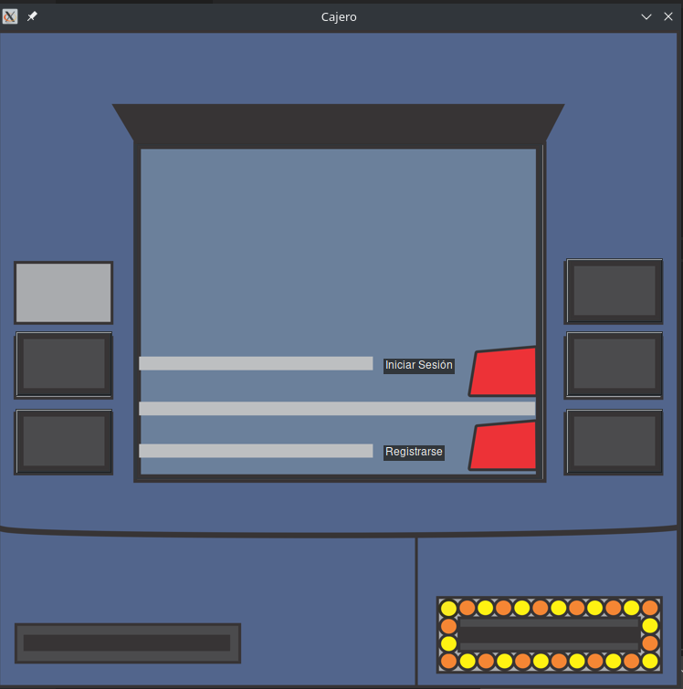
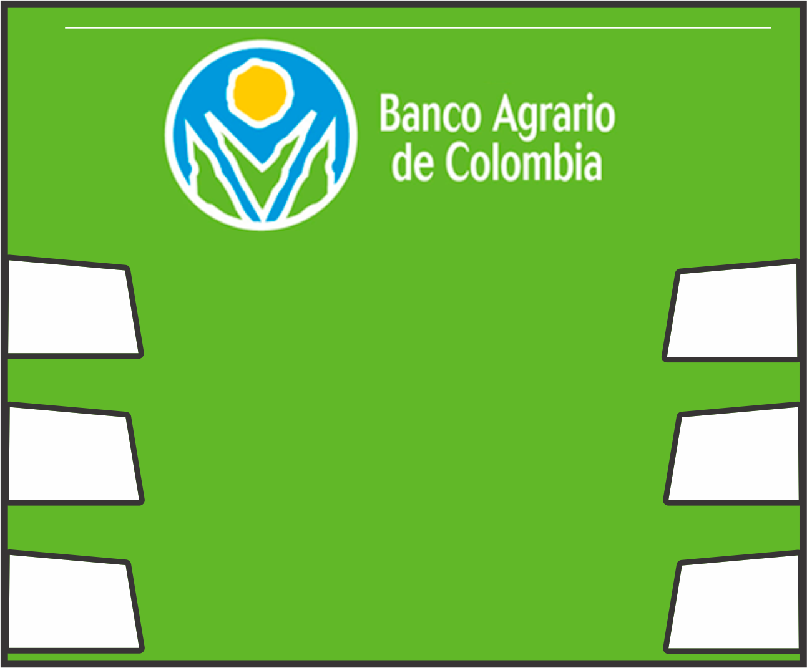
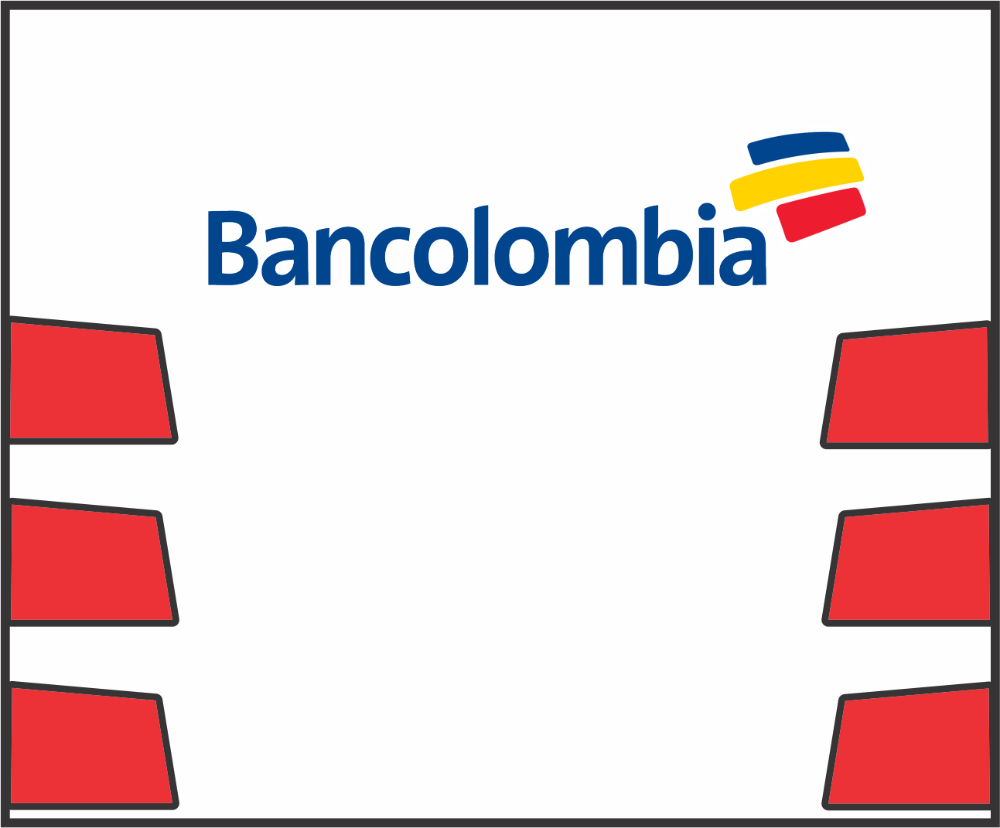
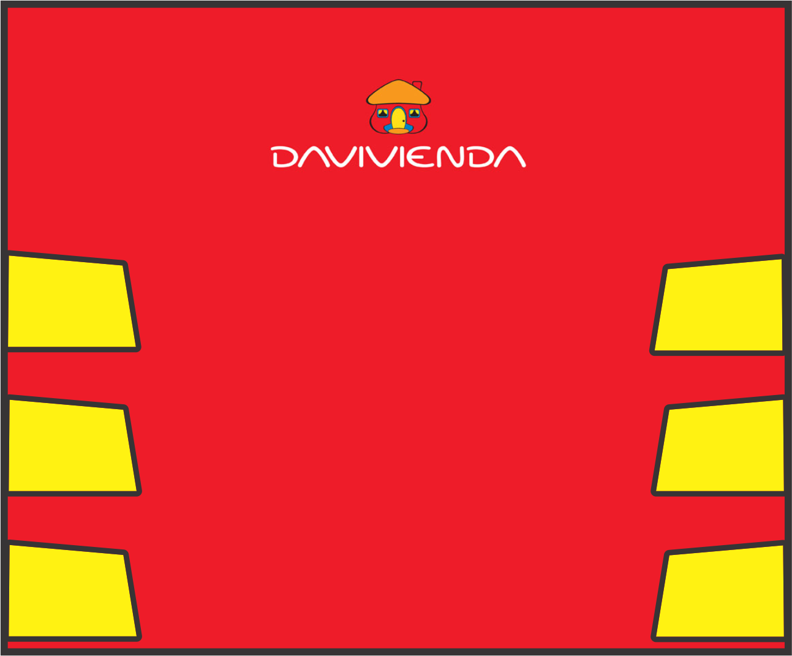

# Proyecto Final

## Integrantes:

- Brayan Alejandro Puentes Camargo  - 20181020044
- Jhonatan Guillermo Ruíz Bautista  - 20181020034
- Juan Camilo Ramírez Rátiva        - 20181020044

## Introducción

 En el presente documento se va a registrar la documentación del proyecto final de la asignatura de modelos de programación I, con el objetivo de explicar y determinar de manera formal la estructura e implementación de nuestro proyecto, el cual consiste en simular un cajero automático multibanca que permita a los usuarios abrir una cuenta, realizar operaciones varias y consultar su estado de cuenta. 

## Descripción

 El objetivo del proyecto es implementar diferentes modelos de programación con el objetivo de simular de manera correcta la funcionalidad de un cajero, para ello el desarrollo del proyecto está realizado en lenguaje Python 3.7.2, usando las librerías Tkinter para manejo de interfaces, y bases de datos MySQL para manejo de información. 

## Recursos

### Pantallas de inicio:

 En esta interfaz el usuario podrá crear una cuenta y entrar a su cuenta en caso de que esta ya exista. 

### Pantallas de registro:

 En esta pantalla el usuario podrá validar la información proporcionada y confirmar el numero de su cuenta, o podrá volver en dado caso de que sienta que proporciono algún dato de manera errónea. 

### Pantalla de Bancos:

#### Banco Agropecuario de Colombia:

#### Bancolombia:

#### Banco Davivienda:

 Estas interfaces cambian según el nombre del banco en el que la cuenta este registrada, sin embargo, las funcionalidades se mantienen 

### Cajero:

 En el cajero se centrará el manejo de interfaces de los sprites de pantalla mencionados anteriormente, incluye 6 slots de botones para la ejecución de comandos y 2 slots para entrada y salida de efectivo. 

## Patrones:

### FACADE:

 Este patrón al proporcionar una interfaz unificada nos facilita el manejo de un conjunto de interfaces adaptadas a la simulación, lo que nos permite un mejor manejo de la estructura de los patrones y ejecución de operaciones. 

### ABSTRACT FACTORY:

 Este patrón proporciona una interfaz que nos permite crear familias de objetos, y como nuestro cajero es multibanca, lo usaremos para poder crear interfaces que tengan diseños diferentes, pero métodos idénticos. 
