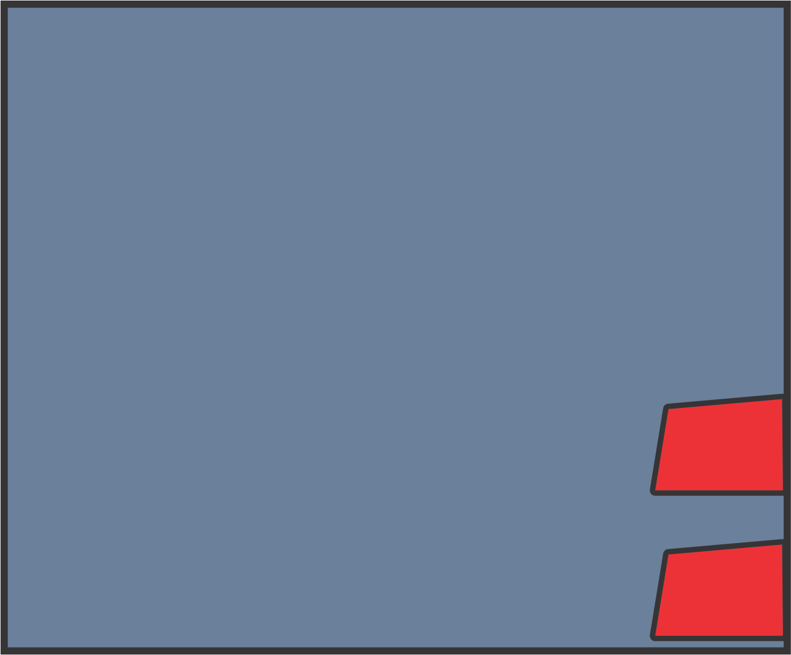

# Proyecto Final

## Integrantes:

- Brayan Alejandro Puentes Camargo  - 20181020044
- Jhonatan Guillermo Ruíz Bautista  - 20181020034
- Juan Camilo Ramírez Rátiva        - 20181020044

## Introducción

 En el presente documento se va a registrar la documentación del proyecto final de la asignatura de modelos de programación I, con el objetivo de explicar y determinar de manera formal la estructura e implementación de nuestro proyecto, el cual consiste en simular un cajero automático multibanca que permita a los usuarios abrir una cuenta, realizar operaciones varias y consultar su estado de cuenta. 

## Descripción

 El objetivo del proyecto es implementar diferentes modelos de programación con el objetivo de simular de manera correcta la funcionalidad de un cajero, para ello el desarrollo del proyecto está realizado en lenguaje Python 3.7.2, usando las librerías Tkinter para manejo de interfaces, y bases de datos MySQL para manejo de información. 

## Recursos

### Pantallas de inicio:

 En esta interfaz el usuario podrá crear una cuenta y/o entrar a su cuenta en caso de que esta ya exista. 

### Pantallas de interactivas:

#### Continuar y Volver

 Esta pantalla permitirá al usuario poder darle al botón de continuar, el cual validará la información que dependerá de las acciones las cuales este interactuando el usuario con el cajero, por ejemplo, si el usuario quiere registrarse tendrá la opción de devolverse en caso de que haya cometido una equivocación, como también tendrá la opción de continuar para registrar su cuenta. 

#### Solo continuar

 Esta pantalla no le permite al usuario poder devolverse, el propósito de esta pantalla es mostrar mensajes de confirmación dada una exitosa o errónea validación de los datos. 

### Pantalla de Bancos:

#### Banco Agropecuario de Colombia:

#### Bancolombia:

#### Banco Davivienda:

 Estas interfaces cambian según el nombre del banco en el que la cuenta este registrada, sin embargo, las funcionalidades se mantienen, es decir, son las mismas para cualquier tipo de banco. 

### Cajero:

 En el cajero se centrará el manejo de interfaces de los sprites de pantalla mencionados anteriormente, incluye 6 slots de botones para la ejecución de comandos. 

## Modelo, Vista, Controlador

 En la ruta de este Git, podemos ver como tenemos 3 packages, uno dentro de otro, para poder hacer bien los respectivos imports tienen un orden jerárquico donde esta la parte de las vistas (views) donde se maneja el tema de las interfaces y lógica de ordenamiento, luego el controlador que maneja arreglos en base a la creación de modelos, nos permite establecer un entorno de desarrollo mas gestionable. 

## Patrones:

### Abstract Factory:

 Este patrón esta enfocado en el manejo de la interfaz, cuyo propósito es hacer que las factorías generen interfaces mediante la creación de familias de objetos, que van variando según la necesidad de la aplicación, estos productos concretos nos devuelven las rutas de almacenamiento de los sprites, que representan las pantallas que tienen una interacción directa con el usuario, debido que nuestro cajero es multi bancos, las factorias nos permiten cargar el banco asociado respectivamente. 

### BUILDER:

 Este patrón nos permite separar la construcción de los productos concretos en el Abstract Factory de su representación, lo que permite a las interfaces poder crear diferentes representaciones y hacer que la transición de imágenes pueda ser mas gestionable. 

### MEDIATOR:

 Este patrón fue introducido en la aplicación con el propósito de poder encapsular las interacciones de los botones, definiendo una función conectar() la cual promueve un bajo acoplamiento para que las operaciones SQL de la clase no se refiera explícitamente con el manejo de las funciones de los botones, haciendo que la interacción entre estas clases se pueda realizar de manera independiente. 
